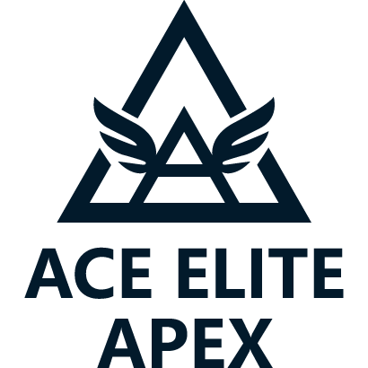

---

## 🇺🇸 英文版：`README.md`

```md
# 🧰 Ace Elite Apex - Official Brand Asset Repository

This is the **official asset repository** for the **Ace Elite Apex** organization, used to manage all visual brand elements such as logos, icons, and banners.

---

## 📁 Folder Structure

| Folder | Description |
|--------|-------------|
| `logo/` | Official logos in multiple formats (PNG, SVG, square) |
| `favicon/` | Website favicon icon |
| `banners/` | Optional social/GitHub banners (future use) |

---

## 🖼️ Logo Preview



---

## 🔗 Usage

Embed in your GitHub README:

```md
